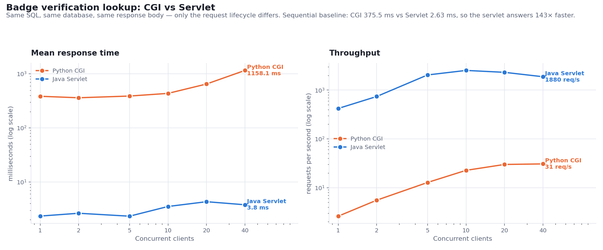

# Verified Digital Skill-Badge Portal

## Why verification services are built on the Servlet model, not CGI

**PBL 3 — Web Technologies**

---

## 1. What was built

A micro-credentialing portal. Students earn skill badges for completing course
modules; each badge carries a tamper-evident verification code that anyone can
check without an account — the same shape as a Credly or LinkedIn Learning
credential link handed to an employer.

The **verification lookup** is implemented twice:

| | Implementation | Server |
|---|---|---|
| A | Python CGI script | Apache HTTP Server 2.4.58 + `mod_cgi`, port 80 |
| B | Java Servlet | Apache Tomcat 8.5.96, port 8080 |

Both run the same SQL against the same MySQL database as the same database user,
and return byte-identical JSON. Only the request lifecycle differs. That is the
experiment.

### Headline result

> The servlet answers the same verification lookup **241× faster** (1.71 ms vs
> 411.81 ms) and sustains **77× the throughput** (1,967 vs 25 requests/second at
> 20 concurrent clients).
>
> Measurement of the CGI request shows why: **0.10% of it is the database lookup
> the user asked for.** The other 99.9% is setup that the process throws away the
> moment it answers.

---

## 2. Data model

Four tables. `badges` is the one the verification endpoint reads.

| Table | Key fields |
|---|---|
| `students` | `student_id`, `name`, `email`, `enrolled_on` |
| `modules` | `module_id`, `title`, `unit`, `code_prefix` |
| `module_completions` | `student_id`, `module_id`, `score`, `completed_at` |
| `badges` | `badge_id`, `student_id`, `module_id`, `verification_code`, `tier`, `score`, `issued_at_ms`, `issued_at`, `revoked` |

Three design decisions worth defending:

**`module_completions` is not in the original brief but is necessary.** A badge is
evidence that work was completed; without a completion record there is nothing for
issuance to check, and the score that drives the Bronze/Silver/Gold tier has
nowhere to live. `IssueServlet` refuses to mint a badge with no matching
completion row, returning `NOT_COMPLETED`.

**`issued_at_ms BIGINT` sits alongside `issued_at DATETIME(3)`.** The epoch
millisecond value is the canonical one and is what gets hashed. Storing it as a
plain integer means Java and Python derive byte-identical digests with no
timezone conversion or fractional-second rounding between the two runtimes. The
`DATETIME` column is for display and for the schema the brief specifies.

**`verification_code` carries a `UNIQUE` index.** This is what makes the lookup an
index probe rather than a table scan in *both* implementations. Without it the
benchmark would partly be measuring MySQL scanning 336 rows, which would muddy
the comparison it is supposed to make.

Seeded with 60 students, 6 modules and 336 completions, from which 336 badges were
issued.

---

## 3. Verification codes and tamper evidence

A code looks like `JS-3986-8312-B276` — a two-letter module prefix, then twelve hex
digits of a SHA-256 digest in three groups of four.

```
payload = studentId : moduleId : issuedAtMillis : secret
code    = prefix + first 12 hex digits of SHA-256(payload), upper-cased
```

The point is not that the code is unguessable. It is that the code is **derived
from the badge it belongs to**. Because the row stores `student_id`, `module_id`
and `issued_at_ms`, the verifier recomputes the code the row *should* carry and
compares it against the code actually stored. Without the signing secret, nobody
can edit a badge row and keep the two in agreement.

This was tested by altering a badge's `issued_at_ms` by a single millisecond
directly in MySQL:

```
before      HTTP 200  {"status":"VALID",    "valid":true,  ...}
tampered    HTTP 409  {"status":"TAMPERED", "valid":false,
                       "message":"This badge record does not match its own
                                  signature and cannot be trusted."}
restored    HTTP 200  {"status":"VALID",    "valid":true,  ...}
```

Both implementations detected it, because both run the same algorithm —
`BadgeCode.java` and `badgecode.py` are deliberate mirrors of each other.

The status vocabulary shared by both endpoints:

| Status | HTTP | Meaning |
|---|---|---|
| `VALID` | 200 | Genuine and current |
| `NOT_FOUND` | 404 | No badge was ever issued with this code |
| `TAMPERED` | 409 | The row does not match its own signature |
| `REVOKED` | 410 | Issued, then withdrawn |
| `BAD_REQUEST` | 400 | No code supplied |

---

## 4. The two implementations

### What the servlet does per request

1. Tomcat takes a thread from its existing pool.
2. The already-loaded, already-JIT-compiled `VerifyServlet` instance is reused.
3. A live JDBC connection is borrowed from the pool.
4. One indexed `SELECT`, one SHA-256, one JSON write.
5. Connection returns to the pool; thread returns to the pool.

Nothing is created and nothing is destroyed. The expensive work — reading config,
loading the JDBC driver, opening 16 database connections — happens once, in
`AppListener.contextInitialized()`, before the first request arrives.

### What the CGI script does per request

1. Apache forks and execs a **new `python.exe`**.
2. CPython initialises its interpreter and import machinery.
3. `json`, `hashlib`, `datetime`, `urllib.parse` are imported.
4. `mysql.connector` and its whole dependency tree are imported.
5. A fresh TCP connection to MySQL is opened and authenticated.
6. One indexed `SELECT`. ← *the only step that is actual work*
7. The response is written to stdout.
8. **The entire process is torn down** — interpreter, imported modules and
   database connection all discarded.

Steps 1–5 and 8 are pure overhead, paid on every request, and nothing learned
during one request survives into the next. There is no hook in CGI equivalent to
`contextInitialized()`, because a CGI process does not outlive the request that
created it.

---

## 5. Where the time actually goes

Rather than assert that process creation is expensive, each stage was measured
(`bench/cgi_cost_breakdown.py`, median of 10 fresh processes per stage):

| Stage | Cumulative | This step |
|---|---|---|
| 1. Process start (fork/exec + interpreter) | 59.6 ms | 59.61 ms |
| 2. + stdlib imports | 112.2 ms | 52.55 ms |
| 3. + `mysql.connector` import | 311.2 ms | **199.02 ms** |
| 4. + connect and authenticate to MySQL | 414.7 ms | 103.55 ms |
| 5. The indexed `SELECT` | 415.2 ms | **0.43 ms** |

Two things stand out.

**The single most expensive item is importing the database driver — 199 ms**,
nearly half the request. It is also the most obviously wasteful: the same modules
are read, compiled and initialised from scratch for every employer who checks a
badge.

**The work the user actually asked for is 0.43 ms, or 0.10% of the request.** The
remaining 414.7 ms is setup. The servlet pays that 414.7 ms once, at startup, and
then answers each request with the 0.43 ms alone.

That the modelled 415.2 ms lands within 1% of the 411.81 ms measured end-to-end
over HTTP is a good sign the breakdown accounts for the whole story.

---

## 6. Benchmark

`bench/benchmark.py`. 100 requests per phase per implementation, preceded by a
discarded warm-up. Codes are drawn at random from the whole `badges` table and
rotated, so neither side benefits from answering one hot row.

Before timing anything, the benchmark asserts that both endpoints return identical
JSON (ignoring `servedBy` and its own `elapsedMs`) and **aborts if they differ** —
if the implementations had drifted apart, the numbers would be comparing different
work.

### Sequential — one client at a time

| Implementation | Mean | Median | p95 | p99 | Min | Max | Throughput |
|---|---|---|---|---|---|---|---|
| Python CGI | 411.81 ms | 410.83 ms | 437.20 ms | 447.39 ms | 342.47 ms | 448.11 ms | 2.4 req/s |
| Java Servlet | **1.71 ms** | 1.33 ms | 3.00 ms | 4.11 ms | 0.81 ms | 22.29 ms | **573.6 req/s** |

### Concurrency sweep

| Concurrent clients | CGI mean | Servlet mean | CGI p95 | Servlet p95 | CGI req/s | Servlet req/s | Speed-up |
|---|---|---|---|---|---|---|---|
| 1 | 411.62 ms | 1.43 ms | 433.14 ms | 2.01 ms | 2.4 | 684.7 | 288× |
| 2 | 401.07 ms | 1.43 ms | 422.19 ms | 2.79 ms | 5.0 | 1358.0 | 280× |
| 5 | 404.35 ms | 1.62 ms | 425.40 ms | 2.57 ms | 12.3 | 2897.9 | 249× |
| 10 | 470.65 ms | 2.86 ms | 504.89 ms | 4.33 ms | 21.0 | 3104.9 | 164× |
| 20 | 752.03 ms | 5.72 ms | 869.07 ms | 14.49 ms | 25.4 | 1966.9 | 131× |



### Reading the curves

**CGI throughput saturates at about 25 requests/second.** It climbs 2.4 → 5.0 →
12.3 → 21.0 → 25.4 and then flattens. The machine cannot create processes any
faster than that, so beyond roughly 10 concurrent clients extra load does not buy
extra throughput — it only buys queueing. Latency confirms it: flat near 400 ms up
to 5 clients, then 470 ms at 10 and 752 ms at 20. Past saturation every additional
employer checking a badge simply waits longer.

**The servlet scales until the client runs out of steam.** 685 → 1,358 → 2,898 →
3,105 req/s, with latency still only 2.86 ms at 10 clients. The dip to 1,967 req/s
at 20 concurrent clients is the Python load generator itself becoming the
bottleneck, not the servlet — which means **the servlet figures are conservative
and the real gap is wider than shown**.

Note that the speed-up *ratio* shrinks (288× → 131×) while the absolute gap
*widens* (410 ms → 746 ms). The ratio falls only because the servlet's own latency
grows off a very small base; in the terms a user experiences, the two are pulling
further apart, not closer.

---

## 7. Why this matters for real credentialing platforms

A credentialing platform's verification endpoint has a particular load shape:
issuance is rare and bursty, but **verification is public, uncontrolled and
spiky**. A graduating cohort puts a few thousand badge links into CVs; those links
get clicked by employers, recruiters and screening tools, in bursts nobody
schedules.

At 25 requests/second, the CGI implementation supports roughly **2.1 million
verifications per day at absolute saturation** — while already making every
employer wait three quarters of a second. Sustained, that is a service running
permanently at its ceiling. The servlet handles the same load at under 1% of
capacity, and its measured 3,105 req/s ceiling is a limit of the test client, not
of the server.

The mechanism behind the difference generalises past this project. Anything a
request handler could usefully keep — a connection pool, a warmed cache, a
compiled query plan, JIT-optimised code, a loaded configuration — CGI is
structurally unable to keep, because its unit of isolation is the process and the
process ends with the request. The servlet container's unit of isolation is the
**thread**, inside one long-lived JVM, so state that is expensive to build is built
once and amortised across every request that follows.

This is why no credentialing platform operating at scale runs verification through
CGI, and it is the same reasoning that later produced FastCGI, `mod_php`, WSGI
application servers and every modern application-server model: they all exist to
stop paying process-creation costs on the request path.

To be fair to CGI: it is genuinely simpler, it isolates faults completely (a
crashing script cannot take down its neighbours), it needs no application server,
and for a low-traffic form handler none of the above matters. The lesson is not
that CGI is bad — it is that the model stops fitting the moment request volume
rises, and verification lookups are exactly that case.

---

## 8. Deployment

Full step-by-step instructions are in [README.md](README.md). In outline:

```bash
mysql -u root -p < sql/01_schema.sql
```

```bash
mysql -u root -p < sql/02_seed.sql
```

```bash
scripts\deploy.bat
```

```bash
scripts\start_tomcat.bat
```

```bash
python bench\issue_badges.py
```

```bash
python bench\benchmark.py
```

`deploy.bat` compiles the servlets, assembles an exploded web application into
`C:\xampp\tomcat\webapps\badgeportal\`, and installs the CGI script into
`C:\xampp\cgi-bin\` with its shebang rewritten to the local `python.exe`. No
`httpd.conf` changes are required: `C:\xampp\cgi-bin` is already `ScriptAlias`-ed,
and a `ScriptAlias` directory executes every file in it regardless of extension.

Servlet mappings are declared explicitly in `web.xml` rather than by `@WebServlet`
annotation, so the whole URL surface is readable in one place:

| Servlet | Mapping |
|---|---|
| `VerifyServlet` | `/api/verify` |
| `IssueServlet` | `/api/issue` |
| `WalletServlet` | `/wallet` |
| `HealthServlet` | `/api/health` |

Three environment-specific problems were hit and are documented with their causes
and fixes in the README: Tomcat must run on the Java 8 runtime because
`Selector.open()` fails under Java 25 on this machine; the MySQL driver must be
vendored beside the CGI script because Apache does not pass `APPDATA` to CGI
processes; and the CGI shebang needs the 8.3 short path because
`C:\Program Files\…` contains a space.

---

## 9. Modules delivered

| Module | Where | Notes |
|---|---|---|
| Badge issuance | `IssueServlet` | Idempotent; checks completion; assigns tier from score |
| Verification lookup (CGI) | `cgi/verify.py` | Benchmarked |
| Verification lookup (Servlet) | `VerifyServlet` | Benchmarked |
| Student wallet | `WalletServlet` | Badges with codes, copy buttons, verify links; issues unclaimed badges |
| Public verify page | `verify.html` | Employer-facing; code only; **switches between the two implementations and shows the round-trip time** |
| Benchmark | `bench/benchmark.py` | CSV, markdown, chart, raw samples |
| Cost breakdown | `bench/cgi_cost_breakdown.py` | Stage-by-stage CGI timing |

Both stretch goals are included: the public verify page, and Bronze/Silver/Gold
tiers assigned from module score (≥90 Gold, ≥75 Silver, otherwise Bronze).

The verify page is worth singling out as a teaching artefact: it answers the same
lookup through either implementation on a toggle and prints the round-trip time,
so the difference this report measures can be watched happening live — typically
around 2 ms against the servlet and 350 ms against CGI.

---

## 10. Limitations

Stated plainly, because they bound what the numbers support.

- **The client is the servlet's ceiling.** The Python load generator saturates
  before the servlet does, so 3,105 req/s is a floor on servlet capacity, not a
  measurement of it. A JMeter or `wrk` run would show a larger gap.
- **Everything is on one machine.** Client, both servers and MySQL share a CPU, so
  they compete. Real deployments separate them.
- **CGI in Python is not the fastest possible CGI.** A compiled C CGI binary would
  avoid the 199 ms interpreter-import cost and land far closer to the servlet.
  What survives that objection is the process-creation floor: 59.6 ms per request
  on this machine, still 35× the servlet's total response time, and unavoidable
  in any CGI implementation in any language.
- **The concurrency sweep stops at 20 clients** to avoid thrashing the machine
  with concurrent `python.exe` processes. CGI has already saturated by then, so
  higher levels would only widen the gap.
- **Codes are 48 bits of digest.** Ample against collision for a project of this
  size and enforced by a unique index, but a production system would use a longer
  code and rotate the signing secret.

---

## 11. Conclusion

The two implementations answer the same question with the same SQL against the
same database and return the same bytes. The servlet does it 241× faster and
absorbs 77× the concurrent load.

The measured cost breakdown explains the whole difference without hand-waving:
**0.10% of a CGI verification request is the lookup; 99.9% is rebuilding context
that the previous request already had and threw away.** The servlet builds that
context once, when the application starts, and every request afterwards is very
nearly just the work.

For a public verification endpoint — the piece of a credentialing platform that
strangers hit hardest and least predictably — that is the difference between a
service that scales and one that is already at its ceiling.
